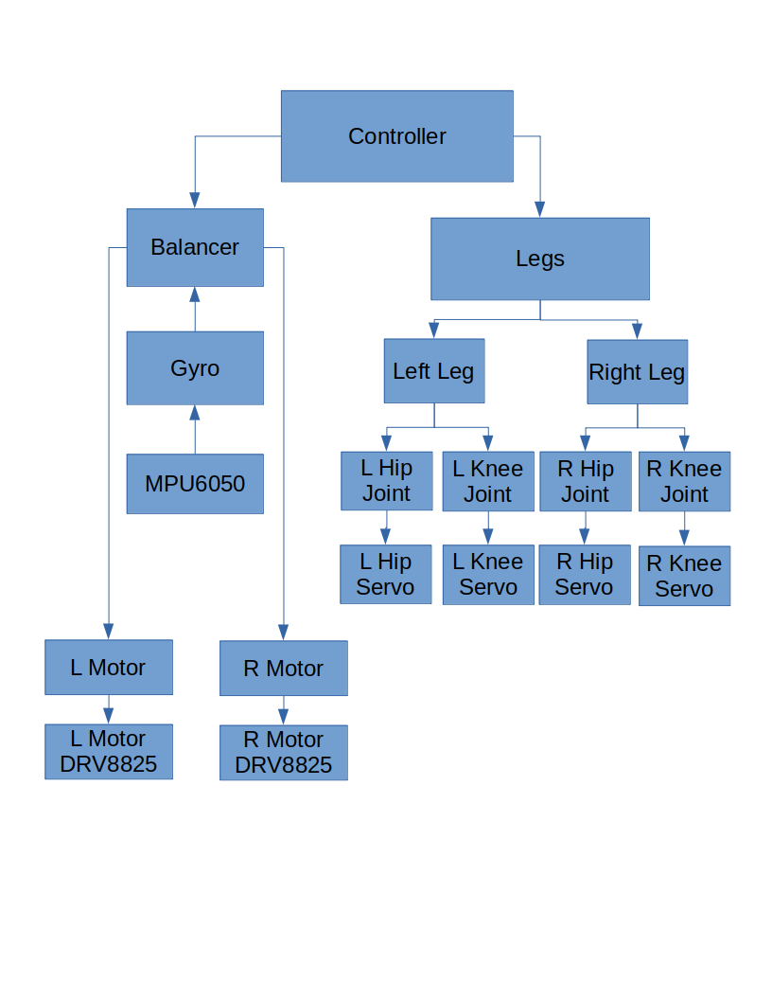
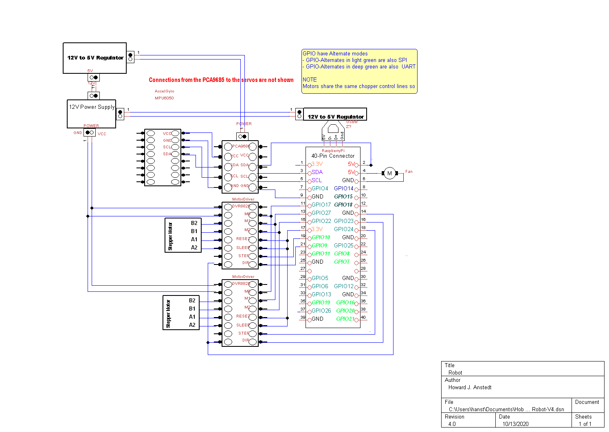

# Robot

### NOTES

### Legs

- Currently contain all Joint information such as channel and pulse
  min/max.  This seems like the wrong place but all other places need
  this information and cannot have it embedded since there are
  multiple objects, such as 2 legs.

- Right leg joints are now roughly correct for 0, 90 and 180 degress.

## Controller
- Creates and controls the robot, constructed from robot.c::main()
- Currently is creates but has no control yet

## Status
- robot
  - Signals
- Controller - just a shell at this time, needs controller interfaces and commands
  - Balancer - needs pid, motion commands, dual motor testing, balance testing
    - Motor - works
    - DRV8825 - works but should be a Linux driver
    - Gyro - works but needs Z averaging on startup
    - MPU6050 - works and tested
  - Legs
    - Leg - works but may need interfaces added
    - Joint - works but may need interfaces added
    - Servo - works but may need interfaces added
      - Interfaces to PCA9685 16 Channel 12 Bit PWM Servo Driver
  - Threads - works and tested

## The robot needs to run as root but cmake takes care of this during the build

## ToDo
- Add a command line interface for setting:
  - Run duration
  - Default motor speed
  - Turning on debug
  - Setting motor mode
- Before using accel Z get an average. Maybe in the Calibrate function
  - While running do not allow large jumps in accel Z to get into the
    current location. Vibrations cause serious gyrations in accel Z.
- Add a speed interface so balancer can more smoothly control the
  motor. May be able to use this to more smoothly get to the final
  location. Rick is thinking of this as well by having ramping
  functions for startup and shutdown. He is thinking of adding this to
  the driver itself. Might be the right thing to do.

- Pull data all at once so that it is all synchronized as spelled out
  in data sheet
- Determine how acc_calibration_value was found in original code

## Data Flow Diagram of the Robot Code

## Electrical Harware Design

## Migrating to c++
- Notice how C++ exceptions are turned off, see CMakeLists.txt
  compiler option CMAKE_CXX_FLAGS. This is to improve performance as
  exceptions can slow the code down drastically and we are trying to
  build a real-time robot control system.

## Option 1: use cmake and Ninja for the build
- Install cmake
  - $ sudo apt-get install cmake
- Install ninja
  - $ sudo apt-get install ninja-build
  - $ sudo ln /usr/bin/ninja /usr/sbin/ninja
- Build the robot using ninja
  - cmake -G Ninja
  - ninja
- Run the robot
  - $ robot

## Option 2: Using cmake and make for the build
- Install cmake
  - $ sudo apt-get install cmake
- Build the robot using make
  - $ cd robot # wherever you have it
  - $ cmake . # you need the '.'
  - $ make
- Run the robot
  - $ ./robot

- To start over with cmake run the following
  - $ rm -rf rules.ninja CMakeCache.txt */CMakeCache.txt CMakeFiles */CMakeFiles -r build.ninja .ninja_* cmake_install.cmake */cmake_install.cmake */lib*.a
