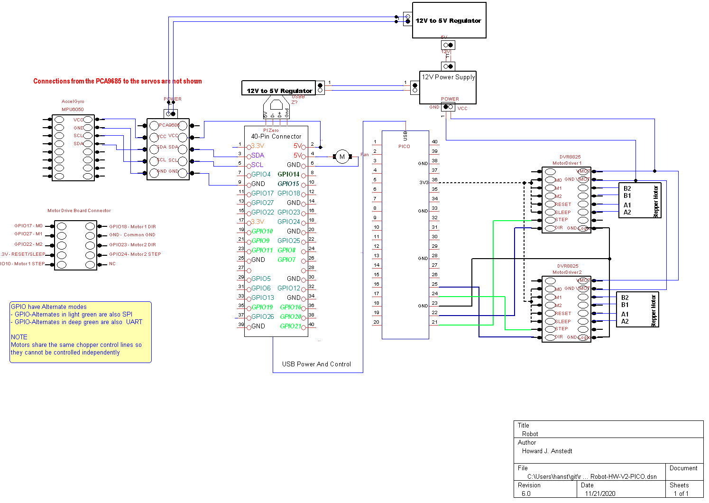

# Robot

# Command line options add:
see ./robot -h

# ToDO
- Fix all printing in Motors.cpp to be logging as needed
- Search for ALL HJA's and fix them
- Update Config.h and associated code for PICO driver. Test for max
  and min motor pps, Config.h says MOTORS_MAX_PULSES_PER_SEC = 10000,
  seems I can go higher than that.  Min pps is 1 since the speed units
  are in Hz.
- Handle min/max motor speed
- Config.h has values for old driver for driver rates.
- Rebuild robot
- Start testing with robot
- Build physical arms for better testing
- Start adjusting PID values

# PICO software install
  - Install MicroPython, see: https://micropython.org/download/rp2-pico/
    - I am using v1.20.0
  - Install Thonny, you need this to install the motor control code. Works fine on Windows and RP.
  - Using Thonny install PICO motor control code: robot/pico/MotorDriver.py
    - First use Thonny to load the MotorDriver.py code
	- You can try to run it but all you get is some output since it runs in a test mode by default
	- To install it on your PICO, after you have loaded into Thonny
	  - Using Thonny in regular mode where you have the menus.
	    - File->Save as
		- You will get a pop up where you select the "Raspberry PI Pico
		- Then save as main.py, you can just click main.py from the list or type it into the File name: location.
		- Then shutdown Thonny since it uses the USB serial connection we need
		- Power cycle the PICO and it is running the MotorDriver.py
		- You can test this out by compiling the Motors code in robot/motors
		- Run this command in the motors directory, cd motors first:
		  g++ Motors.cpp -o MotorsTest -l pigpio -I ../sys -I ../ -I . -DMOTORS_TEST
	    - Then in the motors directory run:
		  sudo ./Motors
		  The test code running is at the end of Motors.cpp
		  With only the PICO connected to the PI via USB you will see some PICO
		  test output on the terminal. This output may change since it is only for debug.
		  
# PICO Motor Control
- Switched to PICO motor control for finer motor control without loading the CPU.
  - Test code seems to show PICO control works perfectly so far.

# PI Zero W
- PI Zero design works fine other than PI Zero W is very slow for development.
  - CPU load testing needs to be done yet.
  - Worst case is we switch to PI Zero W2, very fast but hard to get

# PID Turned off for now for PICO development
- PID is running and checked in on branch pid-dev. It reacts very slowly but
  does work in both directions.  Seems like the range of my output +/- 10000 vs
  the input range +/-180 may be part of this issues.

# Driver Control

# Ranges

### Implement PID based off of Arduino Code
- PID is currently turned off since updating to PICO motor
- driver. Need to turn on and adjust constance.

### Implement mechanism to control robot motion; turning and traveling

### Angles

The front is where the holes are in the upper body. The angles are in reference to the front.
 90: is 90 degrees forward of the front
  0: is straight down
-90: is 90 degrees backwards from the front

### Config
- Config.h has Motor and Legs IO and HW configurations
- Based on PICO design there should be much less Motor constance
### NOTES

### System Logging
- #include "Slog.h" in robot.cpp
- slog << "My Notes" << std::endl;
  "My Notes" in /var/log/message
- SLOG << "My Notes" << std::endl;
  "My Notes" in /var/log/message
  "robot.cpp:33 My Notes" in /var/log/message

### Legs

- Right and Left leg joints are now roughly correct for 90(forward), 0(straight) and -90(back) degress.

## Controller
- Creates and controls the robot, constructed from robot.c::main()
- Control interface is still needed.

## Status
- robot
  - Signals
- Controller - just a shell at this time, needs controller interfaces and commands
  - Balancer - needs pid, motion commands, dual motor testing, balance testing
    - Motor - works
    - DRV8825 - works but should be a Linux driver
    - Gyro - works but needs Z averaging on startup
    - MPU6050 - works and tested
  - Legs
    - Leg - works but may need interfaces added
    - Joint - works but may need interfaces added
    - Servo - works but may need interfaces added
      - Interfaces to PCA9685 16 Channel 12 Bit PWM Servo Driver
  - Threads - works and tested

## ToDo
- Add a command line interface for setting:
  - Run duration
  - Default motor speed
  - Turning on debug
  - Setting motor mode
- Add a speed interface so balancer can more smoothly control the
  motor. May be able to use this to more smoothly get to the final
  location. Rick is thinking of this as well by having ramping
  functions for startup and shutdown. He is thinking of adding this to
  the driver itself. Might be the right thing to do.
- Pull data all at once so that it is all synchronized as spelled out
  in data sheet

## Data Flow Diagram of the Robot Code

## Electrical Harware Design

## Migrating to c++
- Notice how C++ exceptions are turned off, see CMakeLists.txt
  compiler option CMAKE_CXX_FLAGS. This is to improve performance as
  exceptions can slow the code down drastically and we are trying to
  build a real-time robot control system.

## Option 1: use cmake and Ninja for the build
- Install cmake
  - $ sudo apt-get install cmake
- Install ninja
  - $ sudo apt-get install ninja-build
  - $ sudo ln /usr/bin/ninja /usr/sbin/ninja
- Build the robot using ninja
  - cmake -G Ninja .
  - ninja
- Run the robot
  - $ robot

## Option 2: Using cmake and make for the build
- Install cmake
  - $ sudo apt-get install cmake
- Build the robot using make
  - $ cd robot # wherever you have it
  - $ cmake . # you need the '.'
  - $ make
- Run the robot
  - $ ./robot

- To start over with cmake run the following
  - $ rm -rf rules.ninja CMakeCache.txt */CMakeCache.txt CMakeFiles */CMakeFiles -r build.ninja .ninja_* cmake_install.cmake */cmake_install.cmake */lib*.a
