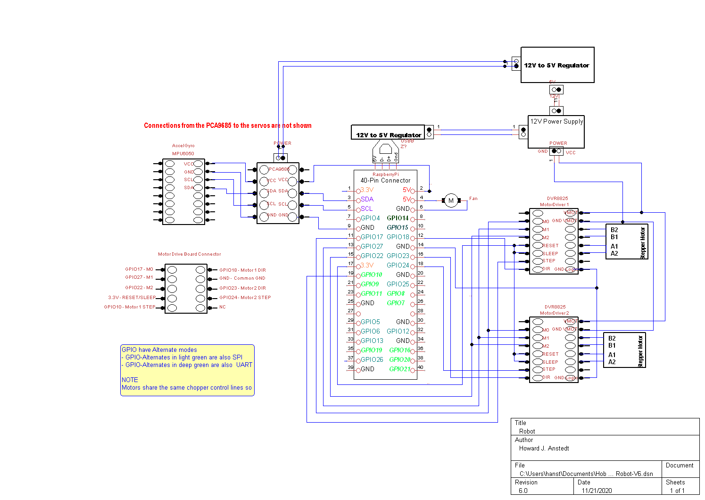

# Robot

# April 08, 2022
Gyro::Run() pulls data from mpu6050 and calls Balancer::m_callback(DATA) with data
Balancer::m_callback(DATA) calls m_motors->AddGyroData(DATA)
m_motors->AddGyroData(DATA) calls m_angle_gyro_fifo.push(DATA)
  currently this fills fifo buffer we no longer need since we can
  directly run motors in same thread.

# April 03, 2022
if (rate > 250)
  driver_rate(rate) // Adjusts rate,distance calls to driver knowing this is called at 250Hz
else
  thread_rate(rate) // Handle driver calls periodically for low rates

MAYBE this should just adjust the runs_per_pulse which is really the
time between pulses every time we get a new value. The issue doing
that is how to make sure this runs at least at a reasonable rate with
changing input values since this will be a count down scheme.

thread_rate(rate)
{
  // Calc runs_per_pulse then update runs_per_pulse_counter
  // If done all the time driver() is never called, maybe do the following
  
  // Run till counter is counted down
     then hit driver and get a new value
	 always keeping track of current pulse per counter
	 if the new rate is lower, conversely the old runs_per_pulse is lower
	 update to the lower rate, larger runs_per_pulse
	 still run the driver at least one time ????, NEED TO TEST IF NEEDED

  if (--runs_per_pulse_counter <= 0)
    driver(rate,distance)
	runs_per_pulse_counter = runs_per_pulse
    curr_per_pulse = runs_per_pulse
  else if (runs_per_pulse > curr_per_pulse) // meaning go slower
    driver(rate,distance) // at least pulse once
    runs_per_pulse_counter = runs_per_pulse
    curr_per_pulse = runs_per_pulse
	
  // Is this easier to think about if we stick to rates until we need
     the values for the counter. I think we need these static
     variables then curr_rate, runs_per_pulse_counter
    
  if (--runs_per_pulse_counter <= 0 || rate < curr_rate)
    driver(rate,distance)
	runs_per_pulse_counter = rate_to_runs(rate)
    curr_rate = rate
}

bool thread_rate(rate)
{
  static int curr_per_pulse = 0; // Really set in constructor
  static int runs_per_pulse = 0; // Really set in constructor
  
  250hz(runs/second)/rate(pulses/second)
  // runs_per_pulse = 250 / 25 == 10

  static int curr_rate = 250;
  
  if (rate 
  
  
  // If the new runs per pulse is less than the current runs per pulse
  // Meaning we need to pulse slower
  if (250/rate < curr_per_pulse
  
  This indicates that the 250Hz thread should call the driver every
  10th time through.
}
# March 20, 2022
- Looks like Motors and MotorsDriver are in process but have much work to do.
- Big change is focus on speed not distance

- Bigger change is handling speeds of 250 pulses/second or less since the
  driver/design can handle 1 pulse/sec. at 250Hz, which would be 250
  pulses/sec., we will need to handle this in application space.
  - Concepts

    - See driver README.md which makes a point that the speed and distance
      values should not be set such that the driver finishes before new cmd's
      are sent.

    - This seems to say we should always have a distance slightly large than the
      speed/distance we select based on our thread rate of 250Hz.

      - Based on this we may need some little algorithm to select distance based
        on speed since the higher the speed the faster the driver completes the
        distance as well as could hot the finish before we get back.
    
  - Examples:
    - Speed = 250Hz: call driver with 250 speed and distance of 2, 1 more than we need so the motor does not stop if we are a little late
    - Speed = 500Hz: speed=500, distance=2, 1 more

    - t_rate = thread rate which is fixed at 250Hz
    - t_jitter = estimate of t_rate jitter compared to set value of 250Hz. Maybe units of Hz.
    - a_speed = speed we comes from the application space
    - a_distance = distance from the applications space, seems like this is not needed since we drive the robot by speed not distance
    - d_speed = the speed we send the driver
    - d_distance = the distance we send the driver

    (d_speed, d_distance) = some_func(a_speed, 250, t_jitter)
    
### Switching to array based driver be more efficient driver processing

### Redesign of commands to control speed and distance required
- Distance needs to be based on mode, speed and 250Hz and of course direction for +/-
  - Example distance = speed in pulses/steps per second
  - Seems like mode should not be needed for this calculations
  - 4ms is 250Hz period
  - Example speed is 125 meaning 125 pulses per second, so we need 125/250 pulses per 4ms period.
  - Even at 1/32 the least I can send is speed=250 and distance=1 which is 250/32 steps 200/7 degrees per second
  - 250 times per second
  - Smallest I can go is distance(p) = speed(p/s)*seconds(s) but I do this 250 times per second.
  - So lets say I want a speed of 1/32 rev per second, witch chopper at 1/32 I need 6400/32 per second.
  - I need a speed of 200 p/s, but I cannot get that since I need to call rick 250 times per second
  - That means I need to feed rick minimum speed=250 and distance=1
### Using user space app driver for testing
- Swap out real driver by renaming
  - motor/MotorDriver.h -> motor/MotorDriver.h.REAL
  - motor/MotorDriver.cpp -> motor/MotorDriver.cpp.REAL
  - motor/Motor.h -> motor/Motor.h.REAL
  - motor/Motor.cpp -> motor/Motor.cpp.REAL
- Swap in app by renaming
  - motor/MotorDriverApp.h -> motor/MotorDriverApp.h
  - motor/MotorDriverApp.cpp -> motor/MotorDriver.cpp
  - motor/MotorApp.h -> motor/Motor.h
  - motor/MotorApp.cpp -> motor/Motor.cpp
- Rebuild Robot with App driver
- The App mimics the kernel driver interface but is a user space application

### Transition to NEW motor system
- Options
  - Dual motor objects?
    - Dual Fifos would work since Gyro Callback goes through Balancer?
  - Is there a need for separate threads?
    - I could call direct from Gyro, through Balancer, but that could stall Gyro in some cases.
    - Biggest issue is Fifo's are polled so the Motor threads still need to run at 250Hz each
    - With Rick's driver the overhead of calls should be minimal so direct calls would work
    - Changes to do this
      - Motor threads removed
      - Motor->AddGyroData() is direct call to Rick's driver
      - Ask Rick if a combined call is best?
        - This could be a static motor call used by each Motor???
- Plan
  - Dual motor Objects
  - Phase one is keep threads
  - Phase two is direct calls, not threads, after I learn more about Rick's driver
  - Phase three, optional. static function to combine both motor calls.

### Transition to Linux driver for motor control
- Build and install driver
- Learn how driver works
- Move to 2 Motor objects rather than 1 Motor object controlling 2 motors
  - This means the Balancer needs to create 2 motors.
  - Question, should the Motor objects share the same running thread?
    - Might need this since there is only one Gyro data Fifo
    - But the Gyro data could be sent to 2 Fifos in AddGyroData()
    - See CallBack in Balancer
- Test out driver on my system
- Work out max speeds based on different micro-step setting

### Implement PID based off of Arduino Code
- Add code to mys system and get it to build
- Move from angle based control to speed and distance control

### Implement mechanism to control robot motion; turning and traveling

### Angles

The front is where the holes are in the upper body. The angles are in reference to the front.
 90: is 90 degrees forward of the front
  0: is straight down
-90: is 90 degrees backwards from the front

### Config
- Config.h has Motor and Legs IO and HW configurations.

### NOTES

### System Logging
- #include "Slog.h" in robot.cpp
- slog << "My Notes" << std::endl;
  "My Notes" in /var/log/message
- SLOG << "My Notes" << std::endl;
  "My Notes" in /var/log/message
  "robot.cpp:33 My Notes" in /var/log/message

### Legs

- Right and Left leg joints are now roughly correct for 90(forward), 0(straight) and -90(back) degress.

## Controller
- Creates and controls the robot, constructed from robot.c::main()
- Control interface is still needed.

## Status
- robot
  - Signals
- Controller - just a shell at this time, needs controller interfaces and commands
  - Balancer - needs pid, motion commands, dual motor testing, balance testing
    - Motor - works
    - DRV8825 - works but should be a Linux driver
    - Gyro - works but needs Z averaging on startup
    - MPU6050 - works and tested
  - Legs
    - Leg - works but may need interfaces added
    - Joint - works but may need interfaces added
    - Servo - works but may need interfaces added
      - Interfaces to PCA9685 16 Channel 12 Bit PWM Servo Driver
  - Threads - works and tested

## The robot needs to run as root but cmake takes care of this during the build

## ToDo
- Add a command line interface for setting:
  - Run duration
  - Default motor speed
  - Turning on debug
  - Setting motor mode
- Add a speed interface so balancer can more smoothly control the
  motor. May be able to use this to more smoothly get to the final
  location. Rick is thinking of this as well by having ramping
  functions for startup and shutdown. He is thinking of adding this to
  the driver itself. Might be the right thing to do.
- Pull data all at once so that it is all synchronized as spelled out
  in data sheet

## Data Flow Diagram of the Robot Code

## Electrical Harware Design

## Migrating to c++
- Notice how C++ exceptions are turned off, see CMakeLists.txt
  compiler option CMAKE_CXX_FLAGS. This is to improve performance as
  exceptions can slow the code down drastically and we are trying to
  build a real-time robot control system.

## Option 1: use cmake and Ninja for the build
- Install cmake
  - $ sudo apt-get install cmake
- Install ninja
  - $ sudo apt-get install ninja-build
  - $ sudo ln /usr/bin/ninja /usr/sbin/ninja
- Build the robot using ninja
  - cmake -G Ninja
  - ninja
- Run the robot
  - $ robot

## Option 2: Using cmake and make for the build
- Install cmake
  - $ sudo apt-get install cmake
- Build the robot using make
  - $ cd robot # wherever you have it
  - $ cmake . # you need the '.'
  - $ make
- Run the robot
  - $ ./robot

- To start over with cmake run the following
  - $ rm -rf rules.ninja CMakeCache.txt */CMakeCache.txt CMakeFiles */CMakeFiles -r build.ninja .ninja_* cmake_install.cmake */cmake_install.cmake */lib*.a
